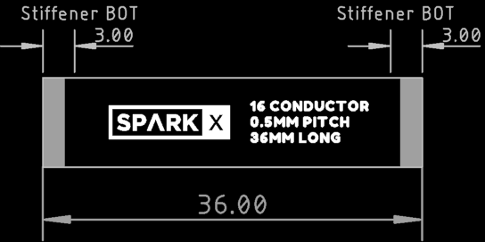

# SparkX smôl FPC 16-way 36mm

[*SparkX smôl FPC 16-way 36mm (CAB-18731)*](https://www.sparkfun.com/products/18731)

FPC interconnect for smôl:
- 16-way; 0.5mm pitch; 36mm long

## Repository Contents

- **/Hardware** - Eagle design files
- **LICENSE.md** contains the licence information

## Product Versions

- [CAB-18731](https://www.sparkfun.com/products/18731) - Original SparkX Release.

## License Information

This product is _**open source**_!

Please review the LICENSE.md file for license information.

If you have any questions or concerns on licensing, please contact technical support on our [SparkFun forums](https://forum.sparkfun.com/viewforum.php?f=123).

Distributed as-is; no warranty is given.

- Your friends at SparkFun.
